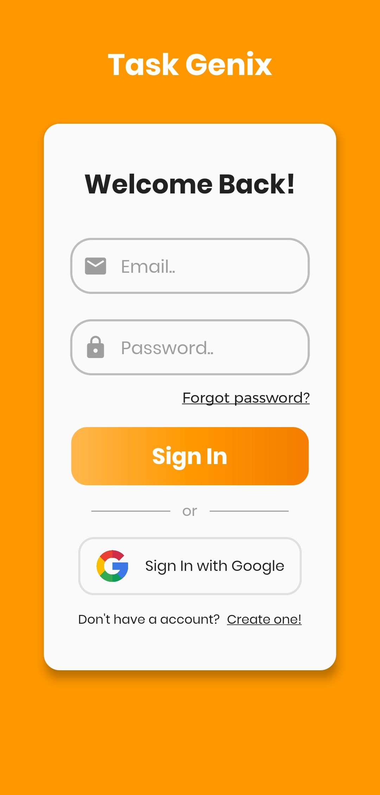
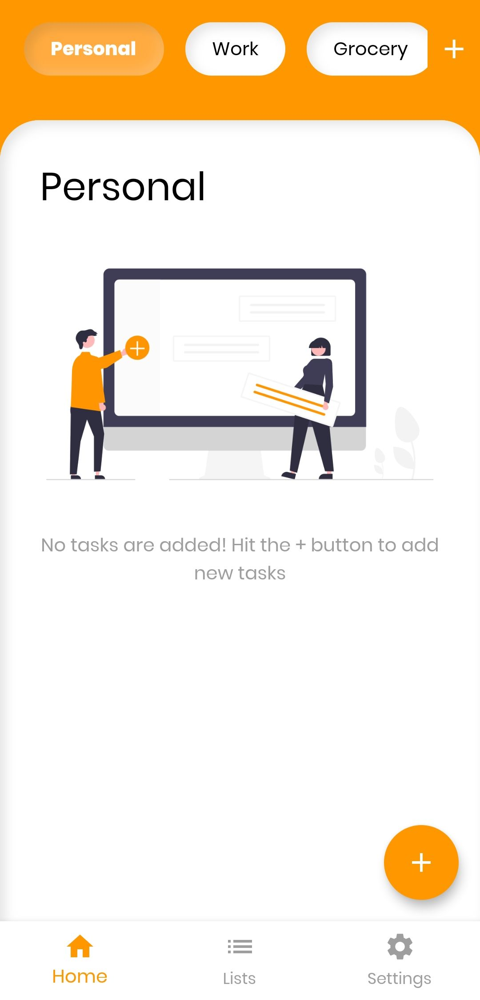
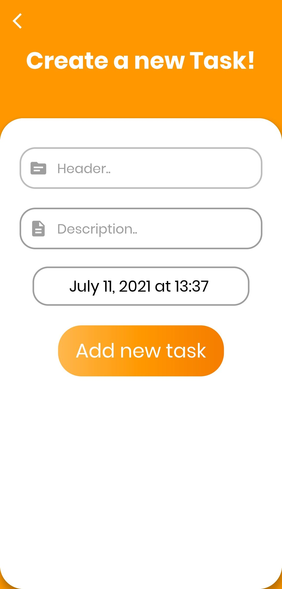
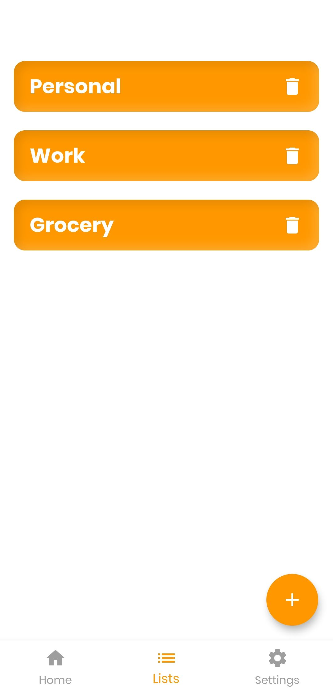
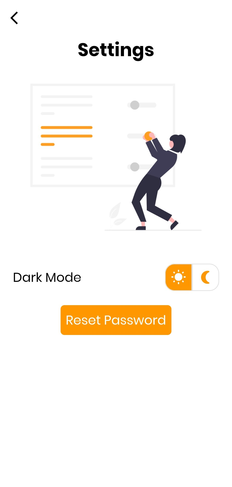
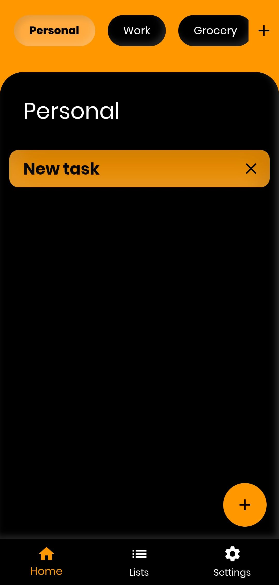

<div align="center">
  <a href="https://task-genix.web.app">
    
  </a>

  <h1 align="center">Task Genix</h1>

  <p align="center">
    A sophisticated task management platform with Neomorphic design
    <br />
    <a href="https://task-genix.web.app"><strong>Try it now »</strong></a>
    <br />
    <br />
    <a href="https://github.com/RishiAhuja/task-genix">View Demo</a>
    ·
    <a href="https://github.com/RishiAhuja/task-genix/issues">Report Bug</a>
    ·
    <a href="https://github.com/RishiAhuja/task-genix/issues">Request Feature</a>
  </p>

  
  
  
  
</div>

> ### ⚠️ Important Notice
> The web version has been optimized from the original mobile app, resulting in reduced Neomorphic effects. Cloud notifications are currently disabled due to server costs. For a complete demonstration of all features including the original Neomorphic design and push notifications, please watch our [demo video on YouTube](https://www.youtube.com/watch?v=DKLgH87Pqo0).

## ✨ Features

- 🎨 **Modern Neomorphic Design**
  - Elegant UI with vibrant orange theme
  - Sleek and contemporary design elements
  - Stunning visual transitions and effects

- 🔐 **Robust Authentication**
  - Email signup and login
  - Google authentication integration
  - Secure user management via Firebase

- 📊 **Kanban Board Management**
  - Intuitive task organization
  - Drag-and-drop functionality
  - Project and task categorization

- 🌓 **Theme Customization**
  - Toggle between dark and light modes
  - Personalized visual experience
  - Eye-friendly interface

- ☁️ **Cloud Integration**
  - Firestore NoSQL database
  - Efficient data management
  - Real-time updates and synchronization

- 🔔 **Smart Notifications**
  - Automated message delivery
  - Scheduled notifications
  - Cloud Functions integration

## 📱 Screenshots

<p align="center">
  
  
  
</p>

<p align="center">
  
  
  
</p>

## 🛠️ Technical Stack

- **Frontend Framework**: Flutter
- **Programming Language**: Dart
- **Backend Services**: 
  - Firebase Authentication
  - Cloud Firestore
  - Firebase Cloud Functions
  - Firebase Hosting
- **Features**:
  - Cross-platform compatibility
  - Real-time data synchronization
  - Push notification system
  - Secure authentication
  - Responsive design

## 🚀 Getting Started

1. Visit [Task Genix](https://task-genix.web.app)
2. Sign up using email or Google account
3. Create your first project or task
4. Organize tasks using the Kanban board
5. Customize your experience with theme options

## 💻 Development Setup

```bash
# Clone the repository
git clone https://github.com/RishiAhuja/task-genix.git

# Navigate to project directory
cd task-genix

# Install dependencies
flutter pub get

# Run the app
flutter run
```

## 🤝 Contributing

Contributions are what make the open source community such an amazing place to learn, inspire, and create. Any contributions you make are **greatly appreciated**.

1. Fork the Project
2. Create your Feature Branch (`git checkout -b feature/AmazingFeature`)
3. Commit your Changes (`git commit -m 'Add some AmazingFeature'`)
4. Push to the Branch (`git push origin feature/AmazingFeature`)
5. Open a Pull Request

## 📫 Contact

Rishi Ahuja
- Portfolio: [Github Portfolio](https://rishiahuja.github.io/my-portfolio)
- Email: [www.rishiahuja@gmail.com](mailto:www.rishiahuja@gmail.com)

## 📱 Follow Me

[](https://x.com/Rishi2220)
[](https://www.linkedin.com/in/rishi-ahuja-b1a224310/)

## 💖 Support

<a href="https://www.buymeacoffee.com/RishiAhuja">
  
</a>
